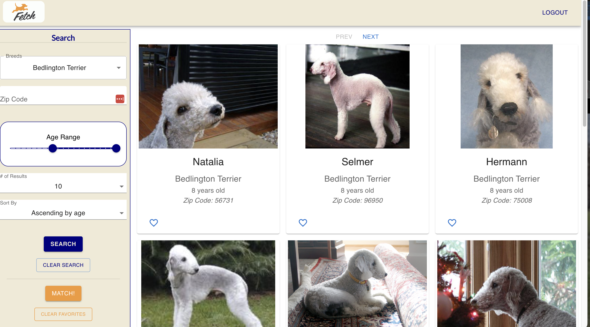

# Fetch Frontend Assessment

## Table of contents

- [Description](#description)
- [Installation](#installation)
- [Usage](#usage)
- [Technologies Used](#technologies-used)

## Description

Are you obsessed with dogs? Constantly looking for a new best friend? Look no further! This application, created for the Fetch frontend assessment, provides you with ALL the dogs you could hope for, right at your fingertips. Search by breed and narrow your search by zip code and age range.

Your next best friend is waiting. Visit [this link](https://mbronstein1.github.io/fetch-frontend-assessment/) to get started!

## Installation

If you wish to run this app on your local machine, use the following steps (you must have Node.js installed and have a Fetch-provided API key):

- Clone this repo to your machine
- Install all dependencies
- Create a `.env.local` file with the following:
  - `REACT_APP_BASE_URL=https://frontend-take-home-service.fetch.com`
  - `REACT_APP_API_KEY= <Fetch-provided API key>`
- Start the app using `npm run start`

## Usage

After running the application, you will be presented with a login page. Feel free to input any name and email address you like, as long as they are formatted correctly.

When you log in, you will be taken to the search page with a list of dogs already loaded for your perusal. Use the search bar on the right (or at the top on mobile) to narrow your search. Search by breed, zip code and age, as well as configure your search by number of items per page and sort by age or name.

At any time, you can clear your search with the 'Clear Search' button and start over!

Each dog card has a little heart in the lower corner, so you can keep track of your favorites! These favorites will be used to find a match for you! Be careful not to refresh the page though, as you will lose your favorites. Of course, future development would include storing favorites in local storage so you can always keep track of your favorites, as well as creating a favorites page where you can view ALL your favorite pups!

Finally when you are finished adding favorites, click the 'MATCH!' button at the bottom of the search bar to be matched with a new furry friend! You can match as many times as you like, and if you'd like to start over, click the "Clear Favorites" button and create a whole new list of favorites!

When you are all finished, you can log out in the top right corner.

## Technologies Used

This is a frontend application that makes calls to the Fetch API. The following frontend technologies were used:

- React Javascript Framework
- Material UI component library
- React Router
- Canvas Confetti NPM package
